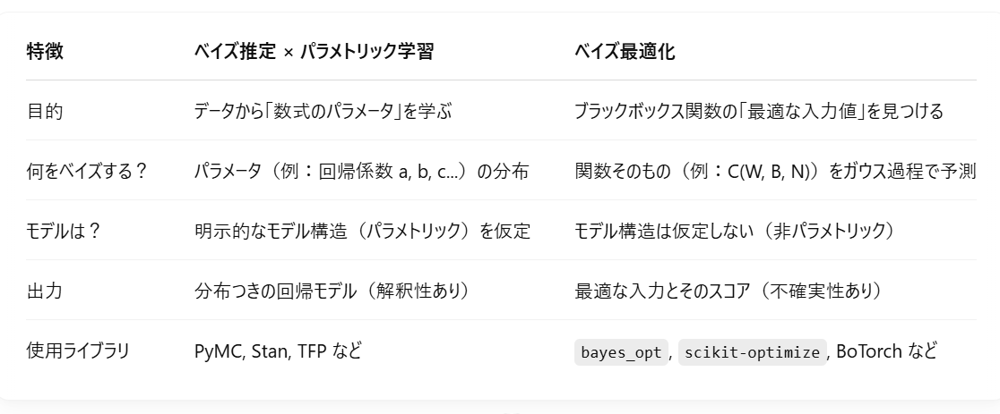

# ポモドーロ最適化問題

- [目的](#目的)
- [方針](#方針)
- [選定理由](#選定理由)
- [ベイズ最適化](#ベイズ最適化)
- [ベイズ推定とパラメトリックな学習による最適化](#ベイズ推定とパラメトリックな学習による最適化)
- [参考](#参考)

## 目的

個人ごとに最適なポモドーロタイマーを導出する

## 方針

**まずは少ないパラメータから最適化を試みる！**

集中度 $C$（目的変数）: (0 $\leqq$ $C$ $\leqq$ 100)  
作業時間 $W$: (1 $\leqq$ $W$)  
休憩時間 $B$: (1 $\leqq$ $B$)  
繰り返し回数 $N$: (1 $\leqq$ $N$)

**今回は、データが揃っていないのでベイズ最適化から答えを模索。**  
**ある程度データがそろったり傾向が見られたらベイズ推定とパラメトリックな学習都のハイブリッドを実現する。**

## 選定理由

- **因果関係に確実性がないから**  
  今回のポモドーロ時の要素と集中度が必ずの関係性を持っていることは保証できないから。  
  「絶対にそう」というより「そうである確率が高い」というアプローチでとりかかる方が良いかも。

- **実データが多くなりづらいから**  
  ポモドーロのデータを取るのには多くの時間がかかり、すぐに多くのデータを取ることが難しいと考えられる。  
  まずは少ないデータでも答えに近づく方法でアプローチをする方が良いかも。

## ベイズ最適化

式を使わず、直接最適な解をベイズの定理の考え方で求める。  
今回はガウス過程を採用したベイズ推定を用いる。  
**ベイズ最適化は「直接最適な入力を探す」手法。**

### ベイズの定理

事象 $ A_1, A_2 $ , ... , $ A_n $ が互いに背反であり、

$$
\Omega = A_1 \vee A_2 \vee ... \vee A_n
$$

ならば、任意の事象 B に対して次が成り立つ。

$$
\begin{align*}
P(B) &= P(A_1)P(B | A_1) + P(A_2)P(B \mid A_2) +...+ P(A_n)P(B | A_n) \\
&= \sum_{i=1}^{n} P(A_i)P(B | A_i)
\end{align*}
$$

よって、

$$
P(A_i \mid B) = {P(B \mid A*i) \over P(B)} = {P(A_i)P(B | A_i) \over \sum_{i=1}^{n} P(A_i)P(B | A_i)}
$$

**条件付き確率の順番を逆にできる**  
**= 「結果」から「原因」を推定できる**  
**=> 「高い集中度」から「最適なポモドーロ」を推定できる！**

### ガウス過程

ガウス過程は以下の 2 つの要素で定義される。

- 平均関数: データの平均的な傾向を捉える。
- **カーネル関数**: データ間の関係性を捉える。

**不確実性の定量化**、**滑らかな関数の近似**、**少数サンプルからの学習能力**において優位性を持つ

### メリット

ベイズ最適化:  
式を自分で考える必要もなく直接答えを求めてくれる。  
**データが多くそろっていない状態からでもはじめられる。**

ガウス過程:  
ガウス過程は予測値だけでなくその不確実性も自然に定量化できることにより、効率的に最適化を進めることができる。  
**非常に非線形であったり、ノイズが多かったり、非凸であったりするような様々な目的関数もモデル化できる。**

### デメリット

ベイズ最適化:  
式がないため、なぜその最適解が得られたか**ブラックボックス**になる。  
式がないため、学習した結果がモデルとして残らない。  
学習結果が残せないので**継続的な学習が難しい。**

ガウス過程:  
ガウス過程には行列演算が必要で、**データセットが増えるほど計算コストが大幅に上昇**する。(目安は 1000 以上)  
ガウス過程は低次元空間に強いため、**データの次元(パラメータ)が増えるほどモデリングが難しくなる**。  
カーネル関数はパラメータの変化に敏感で、パラメータ調整が難しい。

## ベイズ推定とパラメトリックな学習による最適化

数式を用いて最適化をする。  
数式（モデル）はベイズ推定が導出したパラメータを用いて都度更新していく（パラメトリックな学習）。  
ベイズ推定でパラメータを求めた後、そのパラメータを用いて最適化する。  
**ベイズ推定とパラメトリックな学習による最適化は「モデル(数式)を学習する」手法。**

### 数式

今回は最大化が目的なのでマイナスで括る。  
数式例:

$$
C = -(\alpha W^2 + \beta B^2 + \gamma N^2 + \delta WB + \varepsilon BN + \lambda WN + \mu)
$$

### 数式の決め方

**まずは仮説ベースで進める！**

$x$・・・常に比例反比例  
$x^2$・・・山・谷型の関係・あるいは緩やか・極端な変化  
$xy$・・・相互作用の関係がある  
$x^3$以上・・・データ量が多い場合のみ検討

**一定時間あるいは回数をやりすぎると集中度は下がりそうなので、今回は二次関数以上にする。**

### ベイズ推定

ベイズの定理の考えを用いた推定。  
各パラメータに確率分布を与え、新たな観測（データ）が来るたびにその分布を更新し、最終的に目的変数の予測も分布として取得する。

**「これは何%でこれは何%」**といった**確率論的**に求める手法。  
**=>不確実性を考慮できている。**  
**以前のデータを事前分布として参考にして、新しいデータを事後分布にして効率よく学習。**  
**=> 過去の学習データを引き継ぎつつ連続的な学習が可能。**

### メリット

式があるため因果関係を説明できる。  
新しいデータを事後分布として再学習できるため、**継続的な学習が可能**。

### デメリット

式の次元などは固定されているため、**式定義を間違えていたら正しい最適解を求めづらい**。  
**データ量が少ないと推定結果が不安定になりやすい**。

## 参考

### ２大案の比較

### その他の手法

- **線形回帰による数式の最適化**  
  **「答えは必ずこれ！」**といった**決定論的**に求める手法。  
  **新しいデータが入るたびに全てのデータから再学習（数式を再計算）する必要あり。**

- **ランダムフォレスト**  
  高次元データに強く、計算効率も良いが、滑らかな不確実性推定が難しい。

- **ニューラルネットワーク**  
  表現力が高く大規模データに適するが、不確実性の定量化には特殊な工夫が必要。

- **スパース線形モデル**  
  解釈性が高く計算効率が良いが、複雑な非線形関係のモデル化が難しい。
